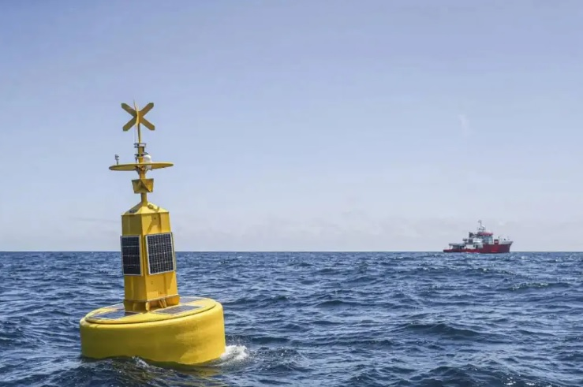
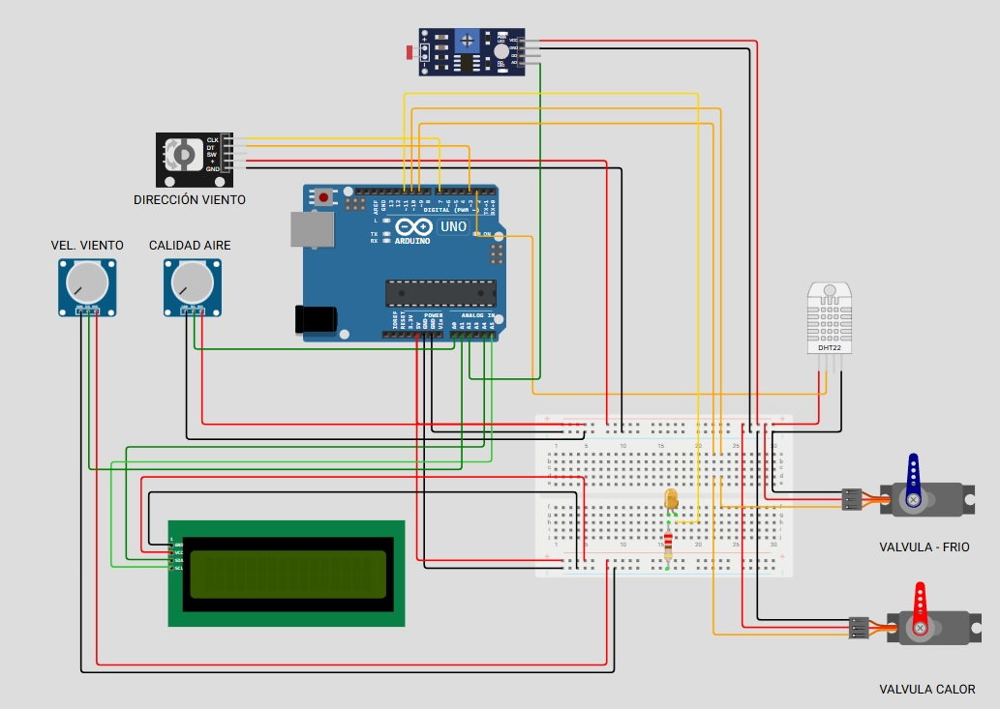

# **Actividad 2: Sistema de control y actuación en función del clima**

  

## *Objetivo*

Partiendo de la actividad 1 que consistía en la realización de una aplicación de medición y presentación de datos del clima, en la que manejamos sensores de temperatura, humedad, iluminación, calidad de aire, velocidad y dirección del viento … de una estación meteorológica (boya climática), procesamos la medición con instrumentación programable (Arduino UNO) y presentamos los resultados en una HMI local (Display LCD I2C). En la presente actividad, que es una continuación de la anterior, añadiremos actuadores y algoritmos de control que, a partir de la medición de los sensores, mantendremos el sistema cercano a los valores deseados y presentaremos los resultados en la HMI local.

Así mismo, se han detectado y corregido los siguientes errores en la actividad 1:
- Se ha cambiado el tipo de variable byte de temperature y humidity a tipo float, ya que al simular el sistema con valores de temperatura negativos, el display devolvía valores fuera de rango.
- Se han creado dos librerías: LCD.cpp que contiene el código relacionado con la presentación de información en el display I2C, y LCD_characters.h que incluye sólo los iconos que se utilizan en el display; con ello conseguimos una estructura modular que facilita el análisis del código, ya sea para depurarlo o para corregir errores, y una mayor flexibilidad a la hora de implementar nuevas funciones. 
- Se ha eliminado el parpadeo del display LCD a través de la función void initDisplayValues() en la librería LCD.cpp presentando los distintos valores por orden sin sobreescribirse constantemente, para ello hemos utilizado un contador que genera una secuencia, y definido un tiempo mínimo de presentación de información de 2s, mientras se ejecuta el loop principal a 500 ms.

## *Descripción*

A partir los valores medidos de temperatura (ºC) e iluminación (lux), se determinan las acciones de control y actuación que garantizan que el sistema de baterías de la boya climática se mantenga alrededor de los parámetros deseados, esto es 25 grados centígrados, y se ilumine un LED para balizar la boya en función de la iluminación en lux del exterior, para ello se han establecido 8 niveles de iluminación (oscuridad < 10 lux, iluminación muy tenue: entre 10 y 100 lux, iluminación tenue: entre 100 y 400 lux, iluminación moderada: entre 400 y 1000 lux, iluminación intensa:  entre 1000 y 1400 lux e iluminación muy intensa > 1400 lux) que se corresponden de forma inversamente proporcional al brillo del diodo LED, es decir a más oscuridad, mayor brillo que se controlará utilizando una salida con modulación por ancho de pulso (PWM), y una resistencia de 220 Ohm que limitará la corriente a través del diodo.

Para el control de temperatura hemos cosiderado dos servomotores que actuarán sobre válvulas de control continuo que permiten el paso de un agente refrigerante o de un fluido caliente por un dispositivo de intercambio térmico con el aire. Para la simulación del proceso térmico hemos considerado una relación proporcional de 8 entre la acción del elemento final y el proceso y un retardo de 500ms (es decir que incrementa o decrementa ocho grados cada 500ms).

Se ha implementado un algoritmo de control continuo de tres posiciones con histéresis y zona muerta, es decir, con acciones continuas proporcionales al error de la medición con respecto al valor deseado. Por ejemplo, si el error es solo de 1 grado se abre solo el 1% de una válvula de control continua y así sucesivamente se incrementa un 1% de apertura de la válvula continua por cada grado de diferencia. En este caso sería un control tipo P con ganancia K=1 para cada acción de control en rampa, enfriar y calentar. Se selecciona este algoritmo porque permite acciones de control en ambos sentidos (calentar y enfriar) y la conmutación se hace en un rango de  +/-3 grados alrededor del valor deseado, que es nuestro caso son 25 ºC. En nuestro caso como son válvulas de control continuo se requiere su cierre o apertura por medio de actuadores eléctricos continuos (servo motores). 

Utilizamos una conexión directa de los servos con las salidas PWM del Arduino porque no se va a actuar sobre ninguna carga, y por tanto el consumo es mínimo. En el caso de que actuaran sobre una carga real, se tendría que emplear una fuente de alimentación externa.

## *BOM*

- [Arduino UNO](https://docs.wokwi.com/parts/wokwi-arduino-uno): Placa de microcontrolador de código abierto basada en el microchip ATmega328 (1). 
-	[DHT22](https://docs.wokwi.com/parts/wokwi-dht22): Sensor de temperatura y humedad digital (1)
-	[LDR](https://docs.wokwi.com/parts/wokwi-photoresistor-sensor): Sensor de iluminación medir la intensidad de luz (luxes) | día – noche (1) 
-	[Potenciómetro resistivo](https://docs.wokwi.com/parts/wokwi-potentiometer): Con uno de los potenciómetros simularemos la velocidad del viento y con el otro la calidad del aire (2)
-	[KY040](https://docs.wokwi.com/parts/wokwi-ky-040): Encoder rotativo para simular la dirección del viento (1)
- [LCD1602](https://docs.wokwi.com/parts/wokwi-lcd1602): Display LCD I2C 16x2, para presentar los datos obtenidos por los sensores de forma amigable (1)
-	[Micro-servomotor](https://docs.wokwi.com/parts/wokwi-servo): Para controlar las válvulas de fluido frío/calor (2)
-	[LED](https://docs.wokwi.com/parts/wokwi-led): Balizamiento de la boya climática en función de la luz exterior (1)
-	[Resistencia](https://docs.wokwi.com/parts/wokwi-resistor): Resistencia de 220 Ohm para limitar la corriente a través del LED (1)
-	Breadboard: Placa para prototipado de tamaño medio (1)
-	Cables de conexión

Se ha realizado el montaje de acuerdo con la fichas técnicas de cada uno de los elementos, estudiado ejemplos de código, realizado la programación y utilizado el simulador [WOKWI](https://wokwi.com/) para compilar y verificar el correcto funcionamiento del sistema. 

Para una aplicación real de un sistema de monitorización instalado en una boya climática, se deben utilizar sensores más robustos especialmente diseñados para ambientes marinos, y un microcontrolador profesional, eficiente en términos de consumo, con buena capacidad de comunicación y posibilidades de expansión, que permita su instalación en una carcasa IP68 para garantizar su estanqueidad.

## *Diagrama del montaje*

  

## *Código comentado*

<pre> 
#include &lt;SimpleDHT.h&gt; // Libreria del Sensor Humedad y Temperatura | DHT22 
#include "LCD.cpp" // Libreia propia para la pantalla LCD I2C
#include &lt;Servo.h&gt; // Libreria para el control de servos

#define DHTPIN 2 // Pin digital 2 como entrada DHT22
#define LCD_COLUMNS 16 // Cantidad de columnas del LCD I2C
#define LCD_LINES   2 // Cantidad de filas del LCD I2C
#define ENCODER_CLK 7 // Pin digital 7 como entrada CLK del encoder
#define ENCODER_DT  3 // Pin digital 3 como entrada DT del encoder

#define SERVO_CALOR  9 // Definimos pin para el control del servo calor
#define SERVO_FRIO  10  // Definimos pin para el control del servo frio
#define LED_PIN     11

int CALIDAD_AIRE_PIN = A0; // Pin A0 como entrada potenciometro CALIDAD_AIRE
int VELOCIDAD_VIENTO_PIN = A1; // Pin A1 como entrada potenciómetro VEL_VIENTO 
int LDR_PIN = A2; // Pin A2 como entrada LDR
int MAX_WIND_SPEED  = 120; // Velocidad máxima del viento en km/h

double defaultPotentiometerValue = 1023.0; //Valor máximo por defecto del potenciómetro

SimpleDHT22 dht22(DHTPIN); // Se crea objeto dht22 y le asigna como parámetro DHTPIN = pin digital donde está conectado el sensor. 
LCD lcd(LCD_COLUMNS, LCD_LINES); // Se crea el objeto lcd y se le asignan como parámetros IC2_ADDR, LCD_COLUMNS, LCD_LINES

// Definimos el valor medio de la veleta (SUR)
int anterior = 10;
volatile int pos = 10;
int maxpos = 19;

// Definimos la dirección de la veleta
String roseta[20] = {"Norte","Noreste", "Noreste", "Noreste","Noreste","Este", "Sureste","Sureste", "Sureste","Sureste","Sur", "Suroeste","Suroeste","Suroeste","Suroeste", "Oeste",  "Noroeste","Noroeste","Noroeste", "Noroeste" };

Servo servoFrio, servoCalor; // Creamos variables para manejar servos
bool counterState = false;
int tempThreshold = 3;
int maxServoLimit = 180; // Limite máximo en pasos de los servos
uint8_t normalStateTempControl[2] = {25, 80}; // Temperatura normal de control del servo frio (25ºC) y humedad(80%) 

//Callback de interrupciones del encoder
void OnEncoderChange() {
  static unsigned long ultimaInter= 0;
  unsigned long tiempoInterrup = millis();
  
  if(tiempoInterrup - ultimaInter > 2) {
    pos = digitalRead(ENCODER_CLK) == HIGH ? pos+1 : pos-1;   
    
    if(pos > maxpos) {
      pos = 0;
    } else if (pos < 0) {
      pos = maxpos;
    }

    pos = min(maxpos, max(0, pos));    
    ultimaInter = tiempoInterrup;
  }
}

void setup() {  
  Serial.begin(115200); //Se inicia la comunicación serie a una velocidad de 115200 baudios (bits por segundo)  

  lcd.init(); //Se inicia la pantalla LC I2C   
  
  //Configuramos los pines como entrada para las lecturas del sensor LDR y encoder. 
  pinMode(LDR_PIN, INPUT);
  pinMode(ENCODER_CLK, INPUT);
  pinMode(ENCODER_DT, INPUT);

  //Configuramos los pines PWM para controlar la intensidad del led. 
  pinMode(LED_PIN, OUTPUT);

  //Configuramos los pines de los servos
  servoFrio.attach(SERVO_FRIO); // Pin 10 como salida servo (válvula frio)
  servoCalor.attach(SERVO_CALOR); // Pin 9 como salida servo (válvula calor)

  //Iniciamos callback de interrupciones del encoder 
  attachInterrupt(digitalPinToInterrupt(ENCODER_DT), OnEncoderChange, LOW);
}

void controlServoState(float *temp) { // Se controla el estado del servo frio y calor  
  int tempActual = (int) *temp;
  
  bool tempIndicator = tempActual > normalStateTempControl[0] ? true : false;

  if(tempIndicator) {
    long servoFrioAngulo = map(tempActual, normalStateTempControl[0]+tempThreshold, 50, 0, 180);
    servoFrio.write(servoFrioAngulo);
    servoCalor.write(0); // Cerrar servo calor mientras actua el frío
  } else {
    long servoCalorAngulo = map(tempActual, normalStateTempControl[0]-tempThreshold, 0, 0, 180); 
    servoCalor.write(servoCalorAngulo);
    servoFrio.write(0); // Cerrar el servo frio mientras actua el calor
  }
}

int ledValueState = 0;
void controlLedState(float lux) {  
  float state = lux;

  if(state > 1400){
    disminuirIntensidadLed(0);
  }

  if(state > 1000 && state < 1400)
  {
    disminuirIntensidadLed(55);
  }

  if(state > 400 && state < 1000)
  {
    disminuirIntensidadLed(83);
  }

  if(state > 100 && state < 400)
  {
    aumentarIntensidadLed(127);
  }

  if(state > 10 && state < 100)
  {
    aumentarIntensidadLed(200);
  }

  if(state < 10)
  {
    aumentarIntensidadLed(255);
  }
}

void aumentarIntensidadLed(int max) { // Se aumenta el valor del led
  for(int bright = ledValueState; bright <= max; bright++) {
    analogWrite(LED_PIN, bright); // Se enciende el led
    
    delay(10);
  }

  ledValueState = max;
}

void disminuirIntensidadLed(int min) { // Se disminuye el valor del led
  for(int bright = ledValueState; bright >= min; bright--) {
    analogWrite(LED_PIN, bright); // Se apaga el led 
    delay(10);
  }

  ledValueState = min; 
}

void loop() {

  //"================ HUMEDAD & TEMPERATURA =================>>");
  float temperature = 0; // declaramos variables locales temperatura y humidity e inicializamos a 0
  float humidity = 0;
  int err = SimpleDHTErrSuccess; // Se inicializa la variable la variable err ¨sin error¨
  if((err = dht22.read2(&temperature, &humidity, NULL)) != SimpleDHTErrSuccess) {    
    lcd.SetError(err);
    return;
  }

  controlServoState(&temperature); // Se controla el estado del servo frio y calor
  lcd.DHTValues(temperature, humidity); // Se envían los valores de temperatura y humedad a la función DHTValues de la clase LCD

  //"================ LUMINOSIDAD  & CALIDAD DE AIRE =================>>");  
  const float GAMMA = 0.7; // coeficiente que determina pendiente curva logarítmica. 
  const float RL10 = 50; // resistencia del LDR a 10 lux (por defecto, 50 kΩ) 
  int ldrValue = analogRead(LDR_PIN); // Lee LDR_PIN y devuelve un valor de 0 a 1023 (resolución de 10 bits) correspondiente a una tensión entre 0 y 5 V 
  float voltage = ldrValue / 1024.0 * 5.0; // Convierte val analógico leído a voltaje 0-5V 
  float resistance = 2000 * voltage / (1 - voltage / 5.0); // Calcula la resistencia del LDR utilizando la fórmula del divisor de tensión 
  float lux = pow(RL10 * 1e3 * pow(10, GAMMA) / resistance, (1 / GAMMA)); // Calcula la iluminación en lux utilizando la relación logarítmica entre resistencia e iluminación 

  controlLedState(lux); // Se controla el estado del led de luminosidad
  int calidadAire = analogRead(CALIDAD_AIRE_PIN); // Lee CALIDAD_AIRE_PIN y devuelve un valor de 0 a 1023

  //Proceso de calidad del aire
  String ca; // declaración variable ca tipo string
  if (calidadAire >= 0 && calidadAire <= 341) {
    ca = "Buena";
  } else if (calidadAire > 341 && calidadAire <= 682) {
    ca = "Normal";
  } else {
    ca = "Mala";
  }
  
  lcd.LDRValues(lux); // Se envían los valores de luminosidad a la función LDRValues de la clase LCD
  lcd.AirQualityValues(ca); // Se envían los valores de calidad de aire a la función AirQualityValues de la clase LCD

  //"================ VELOCIDAD  & DIRECCION DE VIENTO =================>>");
  //Proceso de velocidad del viento
  int readViento = analogRead(VELOCIDAD_VIENTO_PIN); // Lee VELOCIDAD_VIENTO_PIN y devuelve un valor de 0 a 1023
  int offset = (float(readViento) / defaultPotentiometerValue)  * 100; // Convertir a % 
  int kmh = (offset * MAX_WIND_SPEED) / 100;  // Convertir a km/h

  lcd.WindSpeedValues(kmh); // Se envían los valores de velocidad del viento a la función WindSpeedValues de la clase LCD
  lcd.RosetaValues(roseta[pos]);  // Se envían los valores de dirección del viento a la función RosetaValues de la clase LCD

  if(pos != anterior) {       
    anterior = pos; // Se actualiza la variable anterior si pos cambia
  }

  lcd.initDisplayValues();

  delay(500);
}
  </pre>

## *Librerías*

  SimpleDHT  
  LiquidCrystal I2C  
  Servo

### <ins>LCD.cpp</ins>

<pre>#include &lt;SimpleDHT.h&gt;
#include &lt;LiquidCrystal_I2C.h&gt;
#include "LCD_characters.h"

#define I2C_ADDR    0x27

class LCD {        
    public:
        unsigned long displayTimeSpeed = 2000; // Tiempo de refresco de la pantalla LCD en milisegundos
        LCD(uint8_t columnas, uint8_t filas) : lcd(I2C_ADDR, columnas, filas){}
        ~LCD(){};

        void init() 
        {
            lcd.init(); //Se inicia la pantalla LC I2C 
            lcd.backlight();

            addSpecialCharacters();
        }

        void addSpecialCharacters() {
            lcd.createChar(0, (uint8_t*) termometro);
            lcd.createChar(1, (uint8_t*) gota); 
            lcd.createChar(2, (uint8_t*) sol); 
            lcd.createChar(3, (uint8_t*) calidadAire); 
            lcd.createChar(4, (uint8_t*) viento); 
            lcd.createChar(5, (uint8_t*) veleta);    
        }

        LiquidCrystal_I2C* getLCD()
        {
            return &lcd;
        }
    
        void DHTValues(float temperatura, float humedad) {
            Temperatura = temperatura;
            Humedad = humedad;
        }

        void LDRValues(float lux) {
            Lux = lux;
        }

        void WindSpeedValues(int kmh) {
            Kmh = kmh;
        }

        void AirQualityValues(String calidadAireStr) {            
            CalidadAireStr = calidadAireStr;
        }

        void RosetaValues(String rosetaPos) {
            RosetaPos = rosetaPos;
        }

        void SetError(int err) {
            err = err;
        }

        void setTimeSpeed(int timeSpeed) {
            displayTimeSpeed = timeSpeed;
        }

        void initDisplayValues() {
            unsigned long currentTime = millis();                           

            if(err != SimpleDHTErrSuccess) {                
                lcd.clear();
                lcd.println("Error DHT22 ="); // Muestra el mensaje de error
                lcd.println(SimpleDHTErrCode(err)); // Muestra el código de error
                lcd.print(","); 
                lcd.println(SimpleDHTErrDuration(err)); // Muestra la duración del intento de lectura
                return;
            }

            if(currentTime - task_time > displayTimeSpeed){
                if(count >= 3){
                    count = 0;
                }
                
                switch (count)
                {
                    case 0:
                        displayTempAndHumValues();
                        break;
                    case 1:
                        displayLDRValues();
                        break;
                    case 2:
                        displayWindSpeedValues();
                        break;
                }

                count++;
                task_time = currentTime;
            } 
        }
        
    private:
        LiquidCrystal_I2C lcd; // Instancia de la clase LiquidCrystal_I2C
        float Temperatura, Humedad, Lux; // Variables para almacenar los valores de temperatura, humedad y luminosidad 
        int err, Kmh;        
        String CalidadAireStr, RosetaPos;
        unsigned long task_time = millis();
        uint8_t count = 0;

        void displayTempAndHumValues() { // Función que muestra los valores de temperatura y humedad
            lcd.clear();
            lcd.setCursor(0, 0); 
            lcd.write(byte(0)); // Muestra carácter (termómetro) que está en posición mem (0)
            lcd.setCursor(2, 0); // Posicionamos el cursor en la pantalla LCD (columna:2 | fila:0) 
            lcd.print("TEMP: "); // Mostramos el texto TEMP:
            lcd.print((int)Temperatura); // Convierte la variable tipo byte a int y la muestra 
            lcd.print((char)223); // Muestra el símbolo º
            lcd.println("C      "); // Muestra el carácter C

            lcd.setCursor(0, 1);  // Posicionamos cursor en la segunda fila
            lcd.write(byte(1)); // Muestra carácter (gota) que está en posición mem (1)
            lcd.setCursor(2, 1); // Posicionamos el cursor en la pantalla LCD (columna:2 | fila:1)
            lcd.print("HUMEDAD: "); // Mostramos el texto HUMEDAD:
            lcd.print((int)Humedad); // Convierte la variable tipo byte a int y la muestra
            lcd.print((char)37); // Muestra el símbolo %
        }

        void displayLDRValues() { // Función que muestra los valores de luminosidad y calidad de aire
            lcd.clear();
            lcd.setCursor(0, 0); 
            lcd.write(byte(2)); // Muestra carácter (sol) que está en posición mem (2)
            lcd.setCursor(2, 0);
            lcd.print("LUX: ");
            lcd.print(Lux);

            lcd.setCursor(0, 1);   
            lcd.write(byte(3)); // Muestra carácter (calidadAire) que está en posición mem (3)
            lcd.setCursor(2, 1);
            lcd.print("CA: ");
            lcd.print(CalidadAireStr);
        }

        void displayWindSpeedValues() { // Función que muestra los valores de velocidad del viento y dirección
            lcd.clear();
            lcd.setCursor(0, 0); 
            lcd.write(byte(4));// Muestra carácter (viento) que está en posición mem (4)
            lcd.setCursor(2, 0);
            lcd.print("VEL: ");
            lcd.print(Kmh);  
            lcd.print("km/h");

            lcd.setCursor(0, 1); 
            lcd.write(byte(5)); // Muestra carácter (veleta) que está en posición mem (5)
            lcd.setCursor(2, 1);
            lcd.print("DIR: ");
            lcd.print(RosetaPos);
        }
}; </pre>

### <ins>LCD_characters.h</ins>

<pre>const byte termometro[8] = {
  0b00100,
  0b01010,
  0b01010,
  0b01110,
  0b01110,
  0b11111,
  0b11111,
  0b01110
};

const byte gota[8] = {
  0b00100,
  0b00100,
  0b01010,
  0b01010,
  0b10001,
  0b10001,
  0b10001,
  0b01110
};

const byte sol[8] = {
  0b00100,
  0b10101,
  0b01110,
  0b11111,
  0b01110,
  0b10101,
  0b00100,
  0b00000
};

const byte calidadAire[8] = {
  0b00000,
  0b01110,
  0b11111,
  0b11111,
  0b11111,
  0b10101,
  0b00100,
  0b00000
};

const byte viento[8] = {
  0b00100,
  0b01010,
  0b10001,
  0b00100,
  0b00100,
  0b10001,
  0b01010,
  0b00100
};

const byte veleta[8] = {
  0b00100,
  0b01110,
  0b10101,
  0b00100,
  0b00100,
  0b00100,
  0b00100,
  0b00000
};</pre>

## *Link simulación en Wokwi*

https://wokwi.com/projects/431453059341131777 

## *Video simulación*

## *Autores*

- José Luis Darias Perdomo  
- Carlos Barrera Utrera
