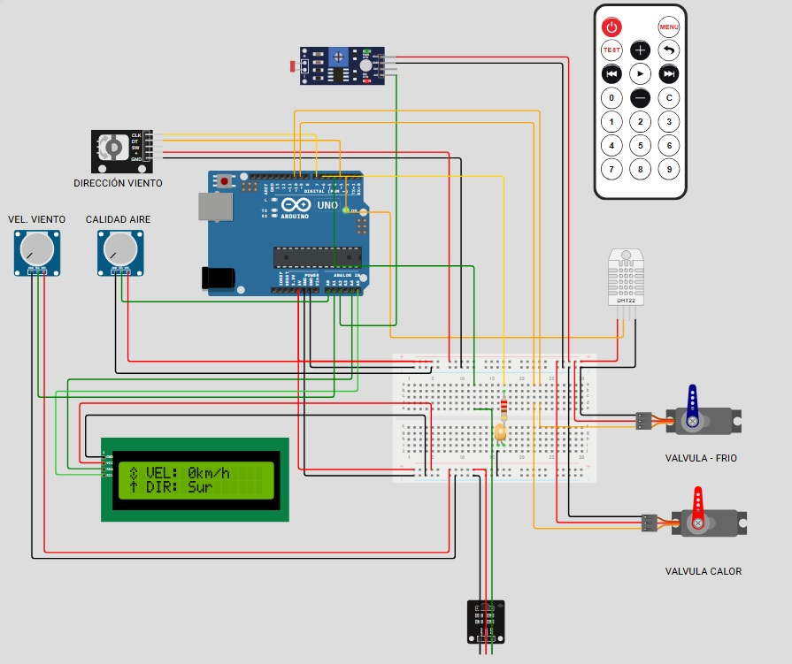

# **Actividad 3: Sistema de medición, control, actuación y presentación del clima, utilizando técnicas de comunicaciones, avanzadas y/o inteligentes**

  

## *Objetivo*

Partiendo de las actividades 1 y 2 que consistían en la realización de una aplicación de medición y presentación de datos del clima, en la que manejamos sensores de temperatura, humedad, iluminación, calidad de aire, velocidad y dirección del viento de una estación meteorológica (boya climática), procesamos la medición con instrumentación programable (Arduino UNO), presentamos los resultados en una HMI local (Display LCD I2C), añadimos actuadores y algoritmos de control que, a partir de la medición de los sensores, nos permitian mantener el sistema cercano a los valores deseados. En la presente actividad, que es una continuación de las anteriores, añadimos técnicas de comunicaciones consistentes en un control remoto IR, que nos permite comprobar el correcto funcionamiento de los sensores de temperatura e iluminación, de tal forma que al pulsar el botón "menú" del control remoto interrumpimos el ciclo de funcionamiento normal y accedemos a un modo "diagnóstico" en el que se presenta un menú donde podemos elegir entre temperatura (1) e iluminación (2), una vez realizada la selección nos aparece en pantalla el valor a actual y con los botones + y - los modificamos y verificamos si actuan correctamente los servomotores y el LED de iluminación, una vez verificados estos elementos podemos salier del modo "diagnóstico" pulsando de nuevo el botón "menú" o el botón "back".

También se ha optimizado el código añadiendo una estructura global denominada SensorData que se encarga de recibir los valores de los diferentes sensores, permitiendo un mejor acceso a los datos, un código más limpio y estructurado, y una mayor flexibilidad frente a ampliaciones y/o modificaciones.

## *Descripción*

A partir los valores medidos de temperatura (ºC) e iluminación (lux), se determinan las acciones de control y actuación que garantizan que el sistema de baterías de la boya climática se mantenga alrededor de los parámetros deseados, esto es 25 grados centígrados y se ilumine un LED para balizar la boya en función de la iluminación en lux del exterior, para ello se han establecido 8 niveles de iluminación (oscuridad < 10 lux, iluminación muy tenue: entre 10 y 100 lux, iluminación tenue: entre 100 y 400 lux, iluminación moderada: entre 400 y 1000 lux, iluminación intensa:  entre 1000 y 1400 lux e iluminación muy intensa > 1400 lux) que se corresponden de forma inversamente proporcional al brillo del diodo LED, es decir a más oscuridad, mayor brillo. El brillo del LED se controla mediante modulación por ancho de pulso (PWM), y una resistencia de 220 Ohm que limita la corriente a través del mismo.

Para el control de temperatura hemos cosiderado dos servomotores que actuarán sobre válvulas de control continuo que permiten el paso de un agente refrigerante o de un fluido caliente por un dispositivo de intercambio térmico con el aire, ya sea un radiador, un serpentín, .... Para la simulación del proceso térmico consideraremos una relación proporcional de 8,2 entre la acción del elemento final y el proceso y un retardo de 500 ms (es decir que incrementa o decrementa 8,2 grados la posición de los servomotores por cada grado de temperatura que aumente o disminuya cada 500 ms).

Se ha implementado un algoritmo de control continuo de tres posiciones con histéresis y zona muerta, es decir, con acciones proporcionales continuas al error de la medición con respecto al valor deseado. Por ejemplo, si el error es solo de 1 grado se abre solo el 4.6% de una válvula de control continua y así sucesivamente se incrementa un 4.6% de apertura de la válvula continua por cada grado de diferencia. En este caso sería un control tipo P con ganancia K = 4.6 para cada acción de control en rampa, enfriar y calentar. Se selecciona este algoritmo porque permite acciones de control en ambos sentidos (calentar y enfriar) y la conmutación se hace en un rango de  +/-3 grados alrededor del valor deseado 25 ºC. La histéresis la conseguimos utilizando variables tipo "int" que hacen que no actúe el sistema con valores decimales. 

Dado que se emplean válvulas de control continuo, su apertura y cierre debe realizarse mediante actuadores eléctricos de operación continua, como los servomotores. Estos se han conectado directamente a las salidas PWM del Arduino, ya que no accionan ninguna carga real y, por tanto, el consumo eléctrico es mínimo. En caso de controlar una carga real, sería necesario utilizar una fuente de alimentación externa con mayor capacidad.

Se ha añadido al código una función de diagnóstico a la que se entra mediante un control remoto, de tal forma que al pulsar el botón "menú" interrumpimos el proceso normal del sistema y accedemos a esta nueva función, la cual nos permite alterar los valores de temperatura (1) e iluminación (2) de forma temporal con el fin de verificar el correcto funcionamiento de los sensores  y los actuadores asociados a ellos (servomotores y LED), es decir, si variamos, en modo diagnóstico, los valores de temperatura, se ve cómo actúan los servos e igualmente si variamos los valores de iluminación actúa el LED. Al salir del modo diagnóstico se presentan nuevamente los valores proporcionados por los sensores.

## *BOM*

- [Arduino UNO](https://docs.wokwi.com/parts/wokwi-arduino-uno): Placa de microcontrolador de código abierto basada en el microchip ATmega328 (1). 
-	[DHT22](https://docs.wokwi.com/parts/wokwi-dht22): Sensor de temperatura y humedad digital (1)
-	[LDR](https://docs.wokwi.com/parts/wokwi-photoresistor-sensor): Sensor de iluminación medir la intensidad de luz (luxes) | día – noche (1) 
-	[Potenciómetro resistivo](https://docs.wokwi.com/parts/wokwi-potentiometer): Con uno de los potenciómetros simularemos la velocidad del viento y con el otro la calidad del aire (2)
-	[KY040](https://docs.wokwi.com/parts/wokwi-ky-040): Encoder rotativo para simular la dirección del viento (1)
- [LCD1602](https://docs.wokwi.com/parts/wokwi-lcd1602): Display LCD I2C 16x2, para presentar los datos obtenidos por los sensores de forma amigable (1)
-	[Micro-servomotor](https://docs.wokwi.com/parts/wokwi-servo): Para controlar las válvulas de fluido frío/calor (2)
-	[LED](https://docs.wokwi.com/parts/wokwi-led): Balizamiento de la boya climática en función de la luz exterior (1)
-	[Resistencia](https://docs.wokwi.com/parts/wokwi-resistor): Resistencia de 220 Ohm para limitar la corriente a través del LED (1)
-	Breadboard: Placa para prototipado de tamaño medio (1)
-	Cables de conexión
- [IR_Receiver](https://docs.wokwi.com/parts/wokwi-ir-receiver): Receptor de IR 38 KHz
- [IR_Remote](https://docs.wokwi.com/parts/wokwi-ir-remote): 38KHz infrared remote with 20 function keys

Se ha realizado el montaje de acuerdo con la fichas técnicas de cada uno de los elementos, estudiado ejemplos de código, realizado la programación y utilizado el simulador [WOKWI](https://wokwi.com/) para compilar y verificar el correcto funcionamiento del sistema. 

Para una aplicación real de un sistema de monitorización instalado en una boya climática, se deben utilizar sensores más robustos especialmente diseñados para ambientes marinos, y un microcontrolador profesional, eficiente en términos de consumo, con buena capacidad de comunicación y posibilidades de expansión, que permita su instalación en una carcasa IP68 para garantizar su estanqueidad.

## *Diagrama del montaje*

  

## *Código comentado*

[sketch.ino](https://github.com/jldarias/Actividad_3/blob/main/src/sketch.ino)

[LCD.cpp](https://github.com/jldarias/Actividad_3/blob/main/src/LCD.cpp)

[LCD_characters.h](https://github.com/jldarias/Actividad_3/blob/main/src/LCD_characters.h)

## *Link simulación en Wokwi*

https://wokwi.com/projects/432734286658860033

## *Video simulación*

[Video](https://alumnosunir-my.sharepoint.com/:v:/g/personal/joseluis_darias769_comunidadunir_net/ESzztvS8R5FOu284jb_6ZjIB3izQD7F872WEL818bN6b0Q?nav=eyJyZWZlcnJhbEluZm8iOnsicmVmZXJyYWxBcHAiOiJPbmVEcml2ZUZvckJ1c2luZXNzIiwicmVmZXJyYWxBcHBQbGF0Zm9ybSI6IldlYiIsInJlZmVycmFsTW9kZSI6InZpZXciLCJyZWZlcnJhbFZpZXciOiJNeUZpbGVzTGlua0NvcHkifX0&e=mAbWXi)

## *Autores*

- José Luis Darias Perdomo  
- Carlos Barrera Utrera
